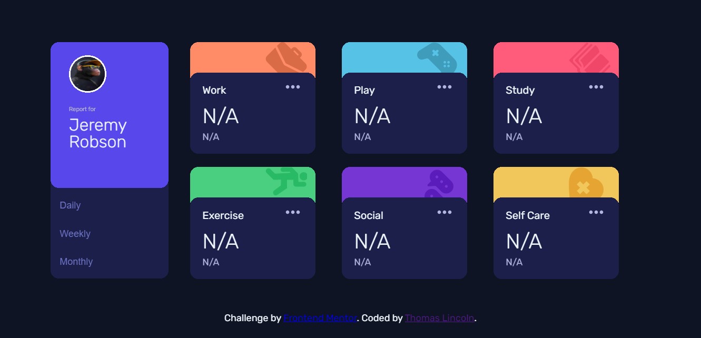
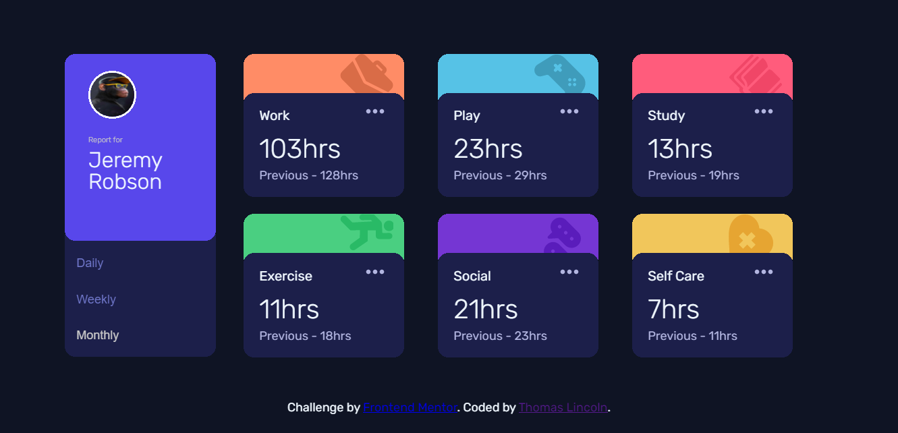
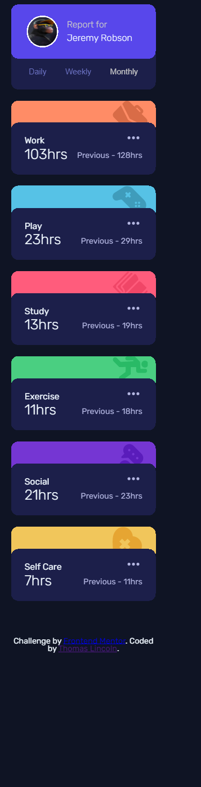

# Frontend Mentor - Time tracking dashboard solution

This is a solution to the [Time tracking dashboard challenge on Frontend Mentor](https://www.frontendmentor.io/challenges/time-tracking-dashboard-UIQ7167Jw). Frontend Mentor challenges help you improve your coding skills by building realistic projects. 

## Table of contents

- [Overview](#overview)
  - [The challenge](#the-challenge)
  - [Screenshot](#screenshot)
  - [Links](#links)
- [My process](#my-process)
  - [Built with](#built-with)
  - [What I learned](#what-i-learned)
  - [Continued development](#continued-development)
  - [Useful resources](#useful-resources)
- [Author](#author)
- [Acknowledgments](#acknowledgments)

**Note: Delete this note and update the table of contents based on what sections you keep.**

## Overview

### The challenge

Users should be able to:

- View the optimal layout for the site depending on their device's screen size
- See hover states for all interactive elements on the page
- Switch between viewing Daily, Weekly, and Monthly stats

### Screenshot

### Links

- Solution URL: [My solution](https://www.frontendmentor.io/solutions/responsive-landing-page-using-pure-html-css-and-js-hB9wEjyC8)
- Live Site URL: [Live site](https://thomaslincoln.github.io/Time-tracking-dashboard-challenge-hub/)

### Built with

- Semantic HTML5 markup
- CSS custom properties
- Flexbox
- CSS Grid
- Pure Javascript

### What I learned

In this project i learned how to use Javascript to modify the DOM.

## Author

- Frontend Mentor - [@Thomas](https://www.frontendmentor.io/profile/ThomasLincoln)
- Twitter - [@samoht_jpg](https://twitter.com/Samoht_jpg)

